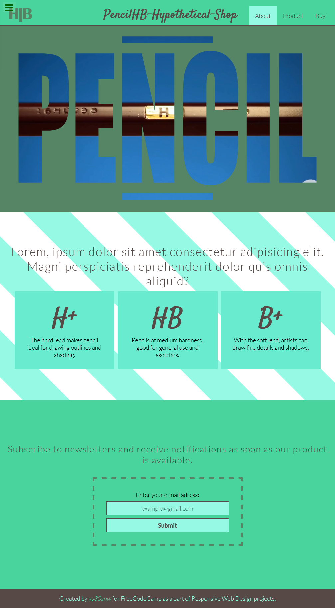

# FreeCodeCamp - Pencil Landing Page

This is a solution to the Responsive Design Series at [FreeCodeCamp](https://www.freecodecamp.org/learn). The page is built using basic HTML and CSS.

- Live Site URL: [GitHub Pages](https://xs30snw.github.io/FCC_pencil-landing/)

## Screenshot

